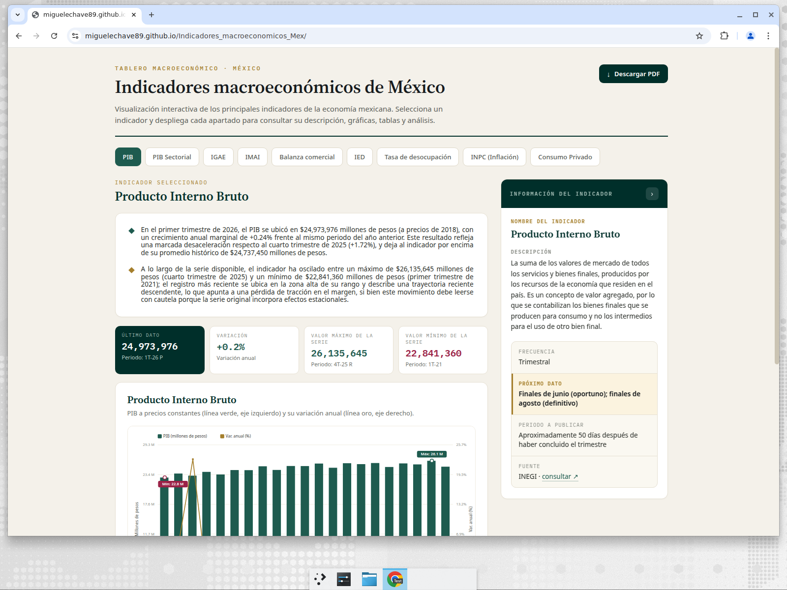
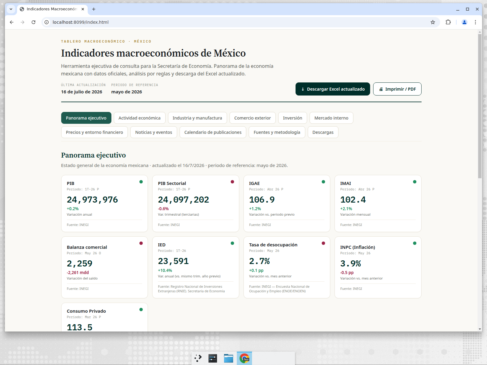
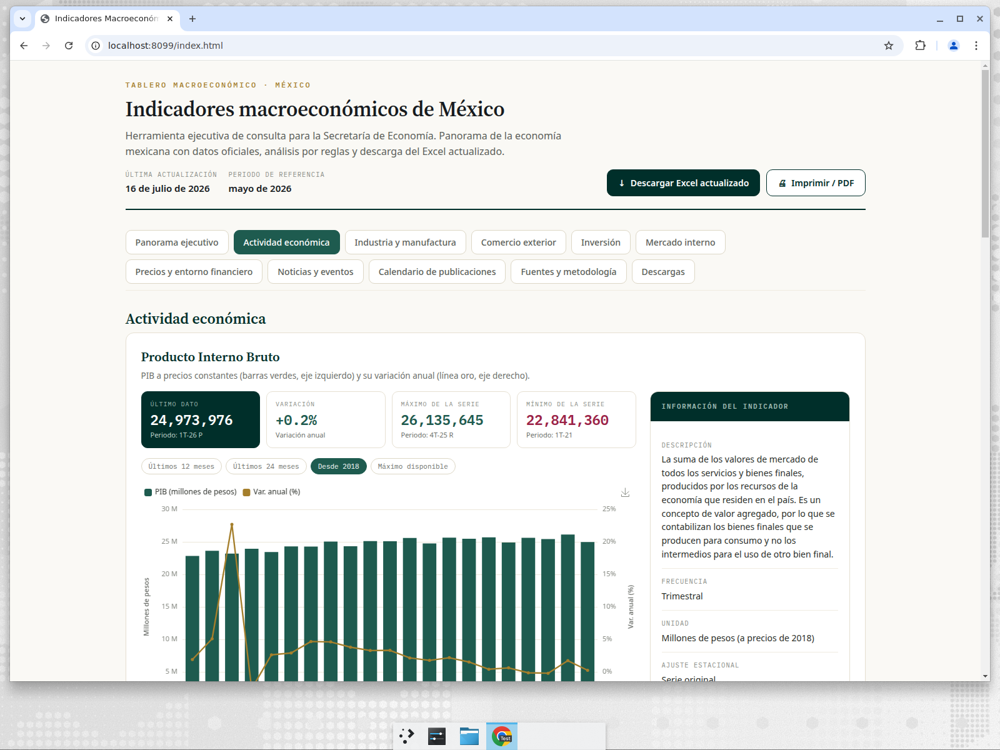
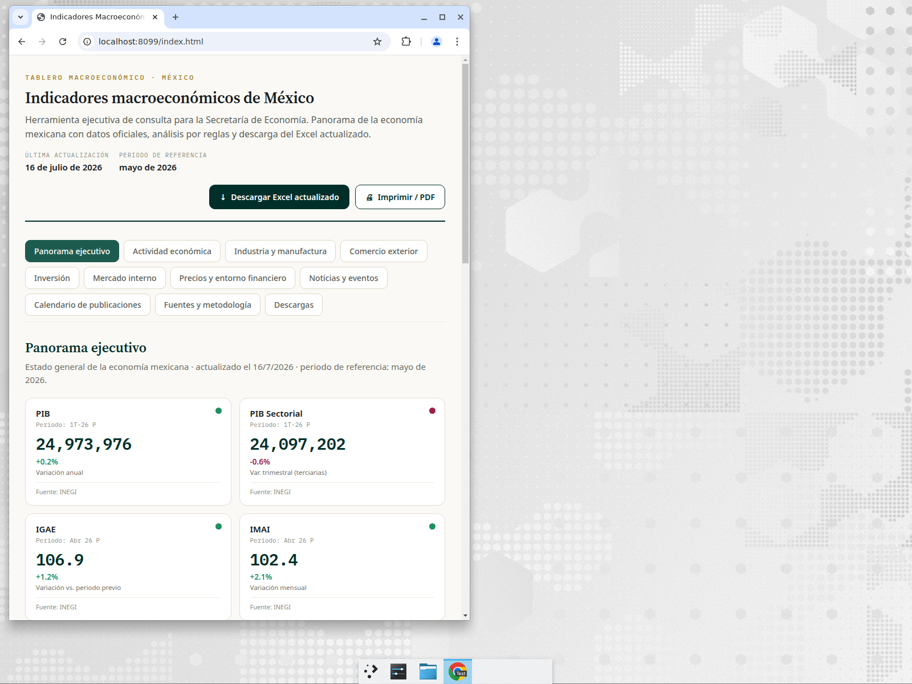
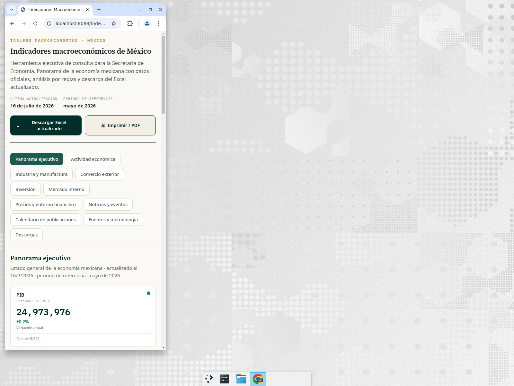

# Comparación antes / después

## Resumen

| Dimensión | Antes (dashboard original) | Después (V2) |
|-----------|----------------------------|--------------|
| Código fuente | `index.html` de 1.5 MB **compilado**, sin fuente editable | HTML + módulos ES + CSS, **auditable y editable** |
| Datos | Embebidos en el bundle, tecleados a mano | `data/indicadores.json` separado, con CSV, manifest y overrides |
| Portada ejecutiva | No existe | Sí: 9 tarjetas, mejoras/deterioros, alertas, próximo dato, resumen por reglas |
| Gráficas | SVG propietario | **ECharts** responsivo, tooltips, exportación, ventanas temporales |
| Descarga de Excel | No | Botón visible → `downloads/…_Actualizado.xlsx` (hojas originales + 3 nuevas) |
| Automatización | Ninguna | Pipeline + conectores (INEGI/Banxico/World Bank) + GitHub Actions |
| Validación de calidad | Ninguna | Duplicados, nulos, rangos, revisiones; modo respaldo sin tokens |
| Calidad de datos | Duplicado IMAI/Consumo feb-26 sin detectar | Detectado, marcado "en revisión" y documentado |
| Atribución desocupación | OCDE | **INEGI/ENOE** (OCDE sólo comparativo) |
| Responsividad | Limitada | Escritorio / tablet / móvil |
| Pruebas / CI | No | `pytest` + workflows de pruebas, actualización y despliegue |

## Evidencia visual

### Antes

### Después — escritorio (portada ejecutiva)

### Después — escritorio (actividad económica, ECharts)

### Después — tablet

### Después — móvil

## Limitaciones conocidas (a la fecha de esta entrega)

- **Tokens pendientes**: sin `INEGI_TOKEN`/`BANXICO_TOKEN`, los datos provienen del
  dashboard original (última versión válida) + contexto anual de World Bank. Tipo de
  cambio FIX, tasa objetivo y el desglose industrial (manufacturas/construcción/minería/
  energía) se activan al cargar los tokens y confirmar los IDs de serie del BIE.
- **IMAI/Consumo feb-2026**: valor duplicado marcado "en revisión" (celda en `null`)
  hasta verificarlo contra INEGI. Ver `REPORTE_IMAI_CONSUMO.md`.
- **Noticias**: los RSS oficiales (INEGI, Banxico, gob.mx, DOF) están protegidos o no
  disponibles desde entornos automatizados; la sección funciona como **piloto** mostrando
  referencias oficiales perennes (sin fabricar noticias con fecha). Ver `scripts/fetch_news.py`.
- **Ventana histórica**: el objetivo es 2018→presente; la profundidad final por serie se
  completará al reconectar las fuentes oficiales con token.
